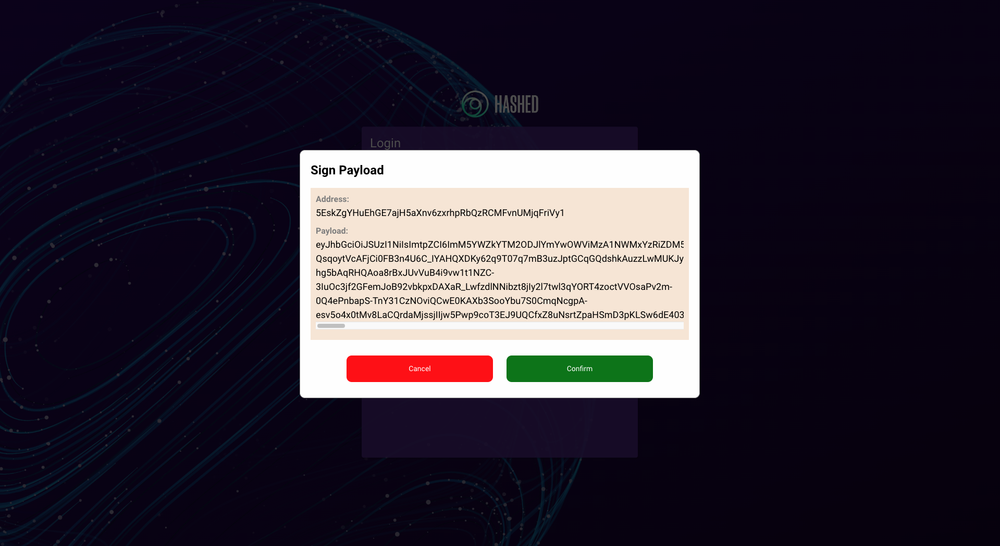
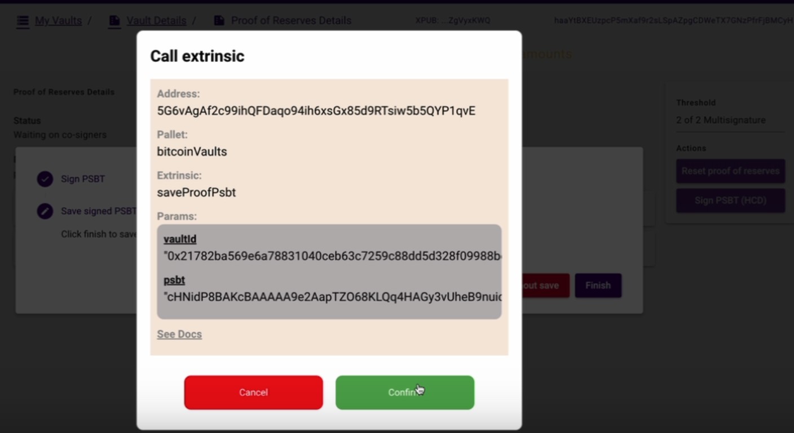

# Native Bitcoin Vault User Guide

This tutorial will go through NBV user flow! The following tutorials will show some words highlighted in blue. If you click on them, they will take you to an external page if that is the case, or they will redirect you to some section of this document.

### Requeriments
* Install one of the following browsers:
    * Firefox -> Download <a href="https://www.mozilla.org/en-US/firefox/new/" target="_blank">here</a>.
    * Google chrome -> Download <a href="https://www.google.com/chrome/" target="_blank">here</a>.
* Install polkadot{.js} extension -> Download <a href="https://polkadot.js.org/extension/" target="_blank">here</a>.
* Install BlueWallet on your mobile
-> Download <a href="https://bluewallet.io/" target="_blank">here</a>

**Note:** If you aren't familiar with any concepts, we suggest reading the <a href="#refConcepts">last section</a> first.

### Sections
 <!-- <a href="#refLogin">How to Login</a> -->
[How to login](#refLogin)
  - [Polkadot extension](#polkadot-extension)
  - [Hashed Confidential Docs](#hashed-confidential-docs-google-signin)

 <a href="#refCreateXPUB">How to create and link a new xpub</a>

 <a href="#refCreateVault">How to create a new vault</a>

 <a href="#refExportVault">How to export your vault and import on Blue Wallet</a>

 <a href="#refDepositVault">How to deposit to vault</a>

 <a href="#refCreateProposal">How to create a proposal</a>

[How to sign a proposal](#how-to-sign-a-proposal)
  - [With Blue Wallet](#with-blue-wallet)
  - [With Google Account](#with-hashed-confidential-docs)

[How to create a Proof of Reserves](#how-to-sign-a-proposal)
- [With Hashed Confidential Docs](#with-hashed-confidential-docs-1)

[How to sign Proof of Reserves](#how-to-sign-proof-of-reserves)
- [With Hashed Confidential Docs](#with-hashed-confidential-docs-2)

 <a href="#refFinalizeProposal">How to finalize and broadcast a proposal.</a>

### How to Login
#### Polkadot extension
First, we need to access to the Hashed Network Portal <a href="https://hashed.club/login" target="blank">site</a>.

1. If you have more of one account imported on **Polkadot extension** you can choose an account.
    

    
    

2. Click "Login" button
    

    
    

3. Sign transaction (You must write your account password)
    

    
    

    **Note:** You can activate the checkbox **Remember my password for the next 15 minutes** to sign transactions easier.

4. If you logged correctly you will see the following screen.
    

    
    

#### Hashed Confidential Docs (Google Signin)

First, we need to access to the Hashed Network Portal [site](https://hashed.club/login).

1. Click "Google Sign In" button
    

    
    

2. Choose an Google Account.
    

    
    

3. Confirm "Sign Payload" modal

    **Note:** If is the first time login into portal.
    

      
    

4. Confirm "Call extrinsic" modal

    **Note:** If is the first time login into portal.
    

      
    

5. If you logged correctly you will see the following screen.
    

    
    

 

### How to create a new xpub.
To create and link a new xpub we have two options:

* [Create a new xpub from NBV](#createANewXpubFromNBV): Create a new xpub and link to your polkadot account using **Hashed portal web** (recommended).

* [Create a new xpub from Blue Wallet App](#createANewXpubFromBW): Create a new xpub using **Blue Wallet App** then you have to [Link your xpub](#refLinkXPUB) using the portal.

### How to create a new xpub from NBV (Option 1 recommended).

1. Go to *Extended Keys* page in the portal.
    

    
    

2. Click *Generate a new XPUB* button.
    

    
    

3. Save your ***Seed*** in a safe place then click on **I saved my seed in a safe place**.

    **Important:** Not share this Seed with anyone, this value is required to sign transactions using your XPUB on Blue Wallet app.

    **Note:** This image is just an example.

    **Note:** If you aren't familiar with any concepts, we suggest reading the <a href="#refConcepts">last section</a> first.

    

    
    

4. Sign the transaction using polkadot extension.

5. Now you have created a new Xpub linked to your polkadot account.

#### Hashed Confidential Docs
1. Go to *Extended Keys* page in the portal.
    

    
    

2. Click *Link XPUB* button.
    

    
    

3. Click "Confirm" button to sign the extrinsic

  

4. Now you have created a new Xpub linked to your polkadot account.

### How to create a new xpub from Blue Wallet (Option 2)

**Note:** You can create a new xpub from NBV web application (recommended) <a href="#createANewXpubFromNBV">How to create a new xpub from NBV web</a>.

1. Open Blue Wallet App on your mobile, we will see a similar screen to the following.
	* Tap on ➕ button on top-right corner.

2. Once taped on add button, we should see the following screen
	* Tap on Vault
	* Tap on ***Create*** button

3. Tap on ***Let's start*** button.

4. Tap on ***Create new*** button.

5. Save your ***Seed*** in a safe place.

    **Important:** Not share this Seed with anyone, this value is required to sign transactions using your XPUB.

    **Note:** This image is just an example.

    **Note:** If you aren't familiar with any concepts, we suggest reading the <a href="#refConcepts">last section</a> first.

6. Tap on ***Share*** button.

7. Take a screenshot of XPUB qr (just as backup) also we can click on ***Share*** button and save the json was generated.

### How to link your XPUB from Blue Wallet (Just valid when you create an Xpub from Blue Wallet)
1. Go to "Extended Keys" page.

2. Click "Scan XPUB from Blue Wallet" button.
3. Open on your mobile the XPUB qr you got on previous steps.

    ***Note:*** If you don't have an XPUB yet please review <a href="#refCreateXPUB">How to create a new XPUB from Blue Wallet</a>.

    ***Note:*** This image is just an example.

4. Scan the XPUB qr.

  **Note:** You must allow camera permission to scan qr.

5. Sign transaction using polkadot extension.

6. Now you should see the next screen

### How to create a new vault

1. Go to "My Vaults" page.
2. Click "Create vault" button.

3. Fill out the form with the following fields.
    * Title (Label)
    * Number of cosigners: Number of cosigners allowed to sign a proposal.
    * Minimum threshold: Minimum number of signatures needed to finalize a proposal.
    * Cosigners address
    * Include owner as cosigner (Default selected)

4. Click "Create vault" button
5. Sign transaction using polkadot extension.
6. Now you can find your new vault on "My vaults" page

### How to export your vault and import on Blue Wallet

1. Go to "My vaults" page.
2. Click the vault you want to see details.

3. You should see the next screen.

4. Click "Export descriptor" button.

5. You should see the next screen.

    **Note:** Please follow the steps showed on the modal.

    **Note:** If you followed successfully the modal steps you can skip the followings steps to export the vault.

6. Go to home screen on Blue wallet app.

7. Tap on ➕ button positioned on top right corner.
8. Top on "Import wallet" button.

9. Tap on "Scan or import a file".
10. Scan this qr from Blue Wallet.
    **Note:** You must allow camera permissions to scan qr.
11. You should see the vault from Blue Wallet

**Note:** ***To sign transactions you need to write the SEED of your xpub***

12. On Blue Wallet click on a vault to see details, you should see the next screen.

13. Click "Manage Keys" button.

14. Click "I have a seed for this key" option for your respective XPUB.

15. Write your SEED and click on Save.

### How to deposit to vault

1. Go to "My vaults" page.
2. Click the vault you want to transfer to see details.

3. Get **receive address** to transfer btc to vault from your preferred wallet.
     * Using QR
        1. Click "Refresh and show qr" button.
        2. Scan this qr from your preferred wallet to transfer founds.

     * Using Address
        1. Click "Refresh and copy" button.

        2. Use this address to transfer founds from your preferred wallet.

4. Click **Refresh** button positioned on bottom right corner to confirm the sats was received successfully.

### How to create a proposal

*Note:* The vault balance must be greather than 546 sats to create a proposal.

1. Go to *Vault Details* page.
2. Click "Create proposal" button.

3. Fill out the form with the following fields:
    * Amount
    * Recipient address
    * Description

4. Click "Create proposal" button.
5. Sing transaction using polkadot extension.
6. You should see your new proposal on *Vault Details* screen.

### How to sign a proposal.
#### With Blue Wallet

**Note:** Remember to import the vault on Blue Wallet app if you have't already.

1. Go to "My Vaults" page.
2. Click the vault that contains the proposal you want to sign, now we are on *Vault details* screen.
3. Click the proposal you want to sign, now we are on *Proposal details* screen.
4. Click "Sign PSBT" button.

5. You should see the next screen.

    **Note:** Please follow the steps showed on the modal.

    **Note:** If you followed successfully the modal steps you can skip the followings steps to sign a proposal.

6. On Blue Wallet go to home screen and click on previously imported vault.

7. Tap on "Send" button.
8. Tap on "..." button, positioned on top right corner.
9. Tap on "Sign a transaction" option.
    **Note:** If this option is not available please confirm you have imported your seed correctly on Blue Wallet. [Tutorial](#refExportVault)

10. Scan this qr from Blue Wallet.

11. When appear "Co-sign this transaction" message tap on "Yes" button.

12. Tap on "Provide signature" button, now you should see a QR.

13. From web app click on "Continue" button.

14. Scan QR generated from Blue Wallet on Web app.

15. Sign transaction using polkadot extension.

#### With Hashed Confidential Docs
1. Go to "My Vaults" page.
2. Click the vault that contains the proposal you want to sign, now we are on *Vault details* screen.
3. Click the proposal you want to sign, now we are on *Proposal details* screen.
4. Click "Sign PSBT (HCD)" button.

5. You should see the next modal and click confirm button to continue

6. Click "Confirm" button to sign PSBT

7. Click "Finish" button to save the sign PSBT

8. Click "Confirm" button to call the extrinsic

### How to create a Proof of Reserves

#### With Hashed Confidential Docs
1. Go to "My Vaults" page.
2. Click a vault in vault list, we are on Vault details screen.
3. Scrool down to Proof of Reserves section.
4. Click "Create pool of reserves" button

    *Note:* The vault must have balance (sats) to create a proof of reserves.
    

      
    

5. Click "Confirm" button to sign the extrinsic
    

      
    

6. Now you have created a new Proof of Reserves.
  

    
  

### How to sign Proof of Reserves
#### With Hashed Confidential Docs
1. Go to "My Vaults" page.
2. Click a vault in vault list, we are on Vault details screen.
3. Scrool down to Proof of Reserves section.
4. Click the proof of reserve in the list, now we are on *Proof of Reserves Details* screen.
5. Click "Sign PSBT" button.

6. You should see the next modal and click "Continue" button to continue

7. Click "Confirm" button to sign PSBT

8. Click "Finish" Button to save signed PSBT

9. Click "Confirm" button to save

### How to finalize and broadcast a proposal.

**Note:** Remember to import the vault on Blue Wallet app if you have't already.

**Note:** To finalize and broadcast a proposal make sure the threshold of multisignature has been met. To sign a proposal review  <a>previous</a> step.

1. Go to proposal page details.

2. Click "Finalize and Broadcast" button.

3. Sign proposal using polkadot extension.
4. Now the proposal is doing broadcasted, in a few minutes you should see the proposal with *Broadcasted* status.

    **Note:** You can click on *Refresh* button positioned on bottom right corner to validate if the status has changed.

5. You can click on "Click to open explorer" link to see the transaction details in a btc explorer.

# **How to Safely Store Your Wallet**

In the following tutorial, we'll talk about some concepts related to wallets & keys so you can be familiar with them.

- ### **About Keys**

You will be given two kinds of keys: a public key, which functions similar to an email address (you may safely share it with others, enabling you to send and receive payments), and a private key, which is often a string of letters and numbers (and which is not to be shared with anyone).

- ### **What is a private key?**

A `private key` is a secret string of letters and numbers that allows you to access and manage your cryptocurrency funds. It is like a password that proves your ownership of your cryptocurrency.

-  ### **About Wallets**

Just like your bank PIN, keeping your private keys safe is important! Store them offline somewhere safe. Some investors keep their private keys on a computer that isn't connected to the internet, written on pieces of paper, or even just memorized.

A common misconception in cryptocurrency regarding wallets is that they store tokens. However, a wallet is used to store private keys in an encrypted file to sign transactions. Therefore, wallets don't serve as a storage medium for tokens.

A user builds a transaction object, usually through an interface (`Proxy website`), sends that object to the wallet to be signed (`Anchor Wallet`); the wallet then returns that transaction object with a signature which is then broadcast to the network. When/if the network confirms that the transaction is valid, it is included in a blockchain block.

- ### **Where To Store Private Keys?**

1. **Hardware Wallets:**  Use hardware wallets to keep your private keys safe. A hardware wallet is a flash drive-like device designed specifically for storing your private keys.

2. **Online? AT YOUR OWN RISK!:** It's not recommended to keep private keys online, in the mail, or in the cloud because they are most susceptible to getting hacked there. Many users take screenshots of their private keys, and their photo album is usually synced online. This previous action creates a security risk and is something you should do at your own risk.

3. **Offline Flash drive:** If you don't have a hardware wallet, you can temporarily keep your private keys or seed in an offline flash drive or HDD. But these options are only safe as long as they aren't in the hands of an attacker.

4. **Paper wallet:** A paper wallet is free and is just a piece of paper that prints the pair of private and public keys on it.
5. **Memorize it:** It's hard to memorize your private key.

We hope these insights will help you make the best decision for yourself and also help you secure your private keys.

